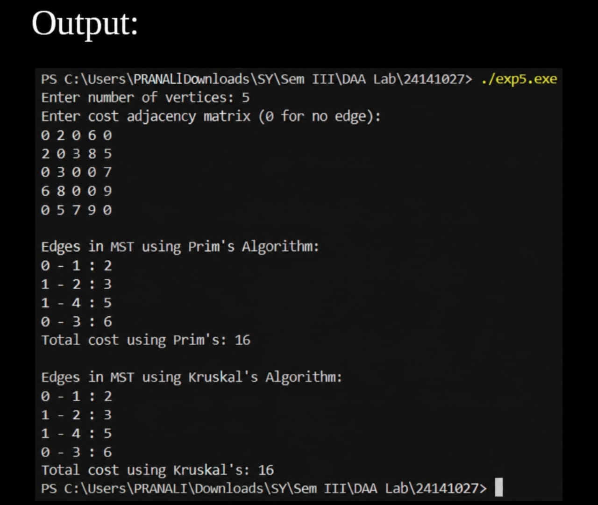

# Experiment No. 05

## Title
**Minimum Cost Spanning Tree of a Given Undirected Graph Using Prim’s and Kruskal’s Algorithms**

### Analyse Time and Space Complexity

### Student Details
- **Email:** pranalihanamantbhopale1@gmail.com
- **GitHub:** https://github.com/pranalihanamantbhopale1-sudo/Experiment5 
 
--- 
 
## Aim 
 
To implement the **Minimum Cost Spanning Tree of a Given Undirected Graph using Prim’s and Kruskal’s Algorithms** and analyze their time and space complexity. 
 
--- 
 
## Program 
 
```
#include <stdio.h>

#define INF 9999
#define MAX 20

void prims(int cost[MAX][MAX], int n){
    int selected[MAX] = {0};
    int noOfEdges = 0, totalCost = 0;

    selected[0] = 1;

    printf("\nEdges in MST using Prim's Algorithm:\n");

    while (noOfEdges < n - 1){
        int min = INF, x = 0, y = 0;

        for (int i = 0; i < n; i++){
            if (selected[i]){
                for (int j = 0; j < n; j++){
                    if (!selected[j] && cost[i][j]){
                        if (min > cost[i][j]){
                            min = cost[i][j];
                            x = i;
                            y = j;
                        }
                    }
                }
            }
        }

        printf("%d - %d : %d\n", x, y, cost[x][y]);

        totalCost += cost[x][y];
        selected[y] = 1;
        noOfEdges++;
    }

    printf("Total cost using Prim's: %d\n", totalCost);
}

int find(int parent[], int i){
    while (parent[i] != i)
        i = parent[i];

    return i;
}

void unionSet(int parent[], int i, int j){
    int a = find(parent, i);
    int b = find(parent, j);

    parent[a] = b;
}

void kruskal(int cost[MAX][MAX], int n){
    int parent[MAX];
    int edges = 0, totalCost = 0;

    for (int i = 0; i < n; i++)
        parent[i] = i;

    printf("\nEdges in MST using Kruskal's Algorithm:\n");

    while (edges < n - 1){
        int min = INF, a = -1, b = -1;

        for (int i = 0; i < n; i++){
            for (int j = 0; j < n; j++){
                if (cost[i][j] < min && i != j){
                    min = cost[i][j];
                    a = i;
                    b = j;
                }
            }
        }

        int u = find(parent, a);
        int v = find(parent, b);

        if (u != v){
            printf("%d - %d : %d\n", a, b, min);

            totalCost += min;
            unionSet(parent, u, v);
            edges++;
        }

        cost[a][b] = cost[b][a] = INF;
    }

    printf("Total cost using Kruskal's: %d\n", totalCost);
}

int main(){
    int n;
    int cost[MAX][MAX];

    printf("Enter number of vertices: ");
    scanf("%d", &n);

    printf("Enter cost adjacency matrix (0 for no edge):\n");

    for (int i = 0; i < n; i++){
        for (int j = 0; j < n; j++){
            scanf("%d", &cost[i][j]);

            if (cost[i][j] == 0)
                cost[i][j] = INF;
        }
    }

    prims(cost, n);

    // Reset INF entries for Kruskal
    for (int i = 0; i < n; i++)
        for (int j = 0; j < n; j++)
            if (cost[i][j] == INF)
                cost[i][j] = 0;

    // Convert back for Kruskal
    for (int i = 0; i < n; i++)
        for (int j = 0; j < n; j++)
            if (cost[i][j] == 0)
                cost[i][j] = INF;

    kruskal(cost, n);

    return 0;
}
```
---

## Output



---

## Applications

1.	Network design (telephone, electrical, or computer networks).
2.	Designing cost-efficient road, railway, or pipeline systems.
3.	Clustering in machine learning (e.g., single-link hierarchical clustering).
4.	Optimizing communication and data transmission networks.
5.	Used in image segmentation and circuit design problems.
6.	Applied in routing protocols and distributed systems.
7.	Forms the basis for many advanced graph optimization algorithms

---

## Conclusion

Through this experiment, I learned how both Prim’s and Kruskal’s algorithms efficiently construct Minimum Spanning Trees using different Greedy strategies. Implementing and comparing them deepened my understanding of their time-space trade-offs and suitability for dense versus sparse graphs. This exercise enhanced my ability to choose the appropriate MST algorithm based on problem constraints.

